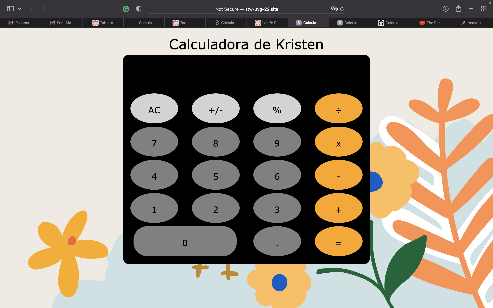

# Calculadora
Calculadora hecha con React

Laboratorio 10 de Web 

En este git se encuentra el código para la calculadora reealizada 

Para ver la calculadora en el servidor de la clase:
http://stw-uvg-22.site/lab10/KABF171482/bundle_react/index.html

Se utilizo como base el ejemplo de estos tutoriales:
- [x] https://www.youtube.com/watch?v=SydnKbGc7W8
- [x] https://www.youtube.com/watch?v=DgRrrOt0Vr8
- [x] https://www.youtube.com/watch?v=deyxI-6C2u4&feature=emb_title

